## House pics

**Note** You can click into any of these photos to zoom - or right click and open in a new tab. The photos may take a minute to load the first time you visit. Thanks Frank!

[It's all relative](backup_index.md)

<Caption>
Image 1: Exterior view of north east (NE) ground floor window.
</Caption>

<Caption>
Image 2: Detail exterior view of NE ground floor window.
</Caption>

<Caption>
Image 3: "Outbuilding 1" - Some cobblestone visible but not sure if there is more still there under the chips.
</Caption>

<Caption>
Image 4: Northern face of the house - yellow insulation foam seeping was "inserted to get rid of wasps nests".
</Caption>

<Caption>
Image 5: Detail of northern face showing foam, red brick, condition of eaves and some plasterwork on western face.
</Caption>

<Caption>
Image 6: Courtyard to west of of the building. Showing balcony (I would remove) and more cobblestone under cement here.
</Caption>

<Caption>
Image 7: Doorway of "Outbuilding 1".
</Caption>

[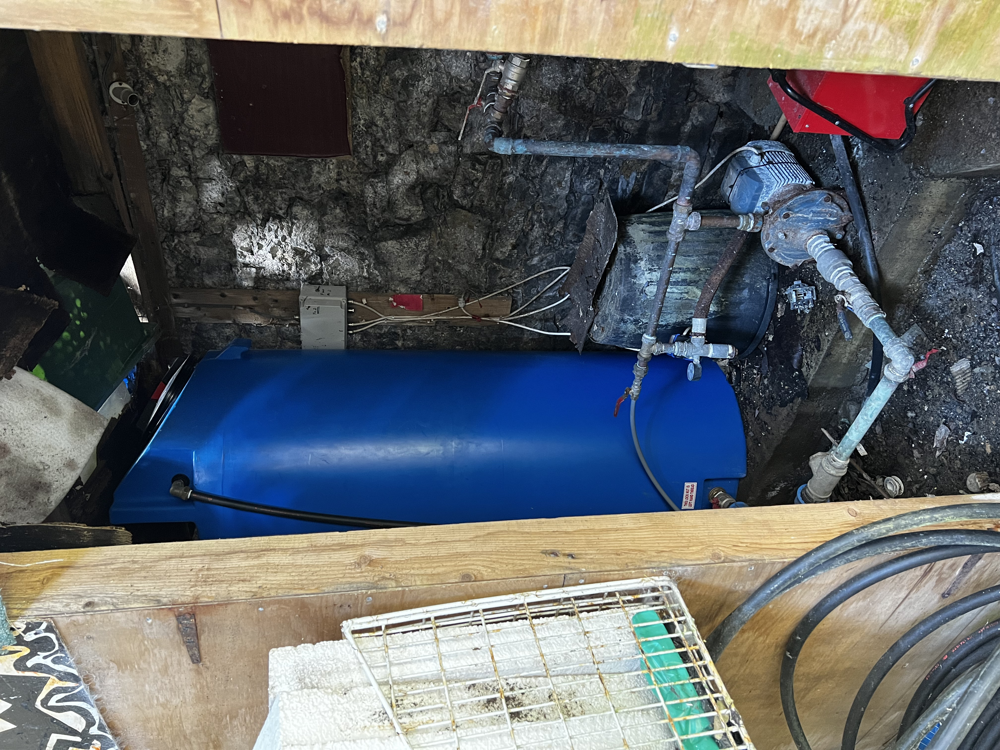](images/8.jpeg)
<Caption>
Image 8: Water supply for house from "Outbuilding 1".
</Caption>

[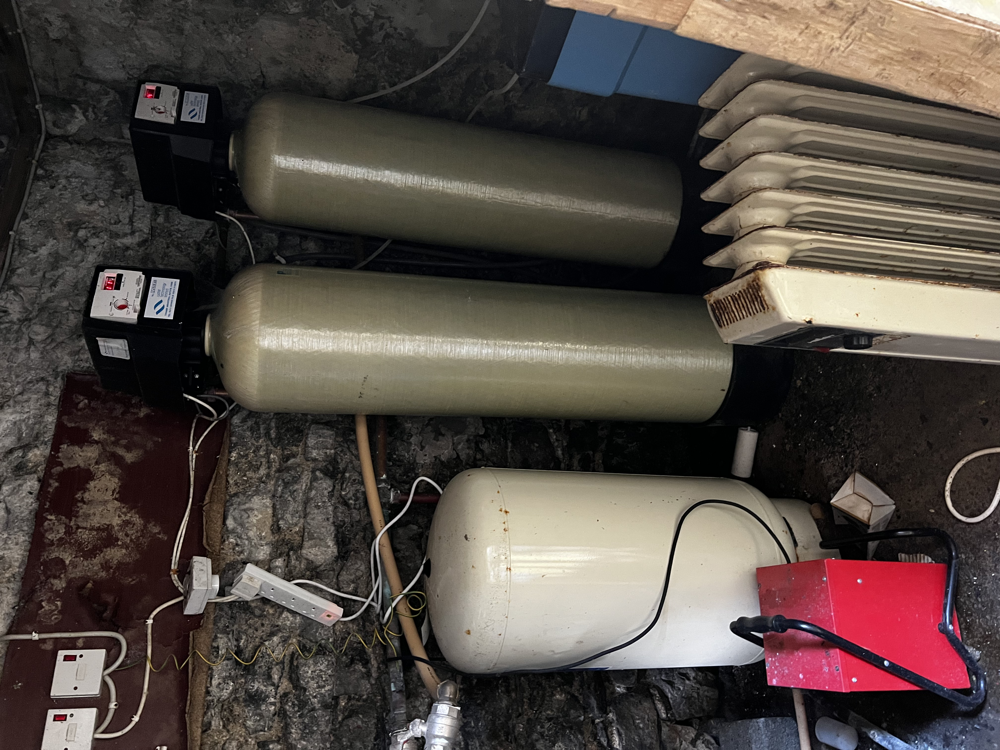](images/9.jpeg)
<Caption>
Image 9: The other side of the room from image 8.
</Caption>

[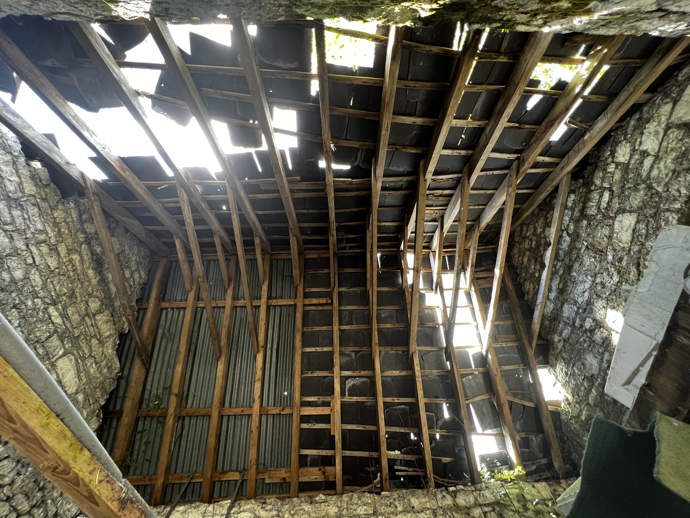](images/10.jpeg)
<Caption>
Image 10: Interior view of roof of "Outbuilding 1".
</Caption>

<Caption>
Image 11: Guest lodge - didn't get inside but seems in good nick.
</Caption>

<Caption>
Image 12: "Tower house" eastern face.
</Caption>

<Caption>
Image 13: "Tower house" eastern door detail.
</Caption>

[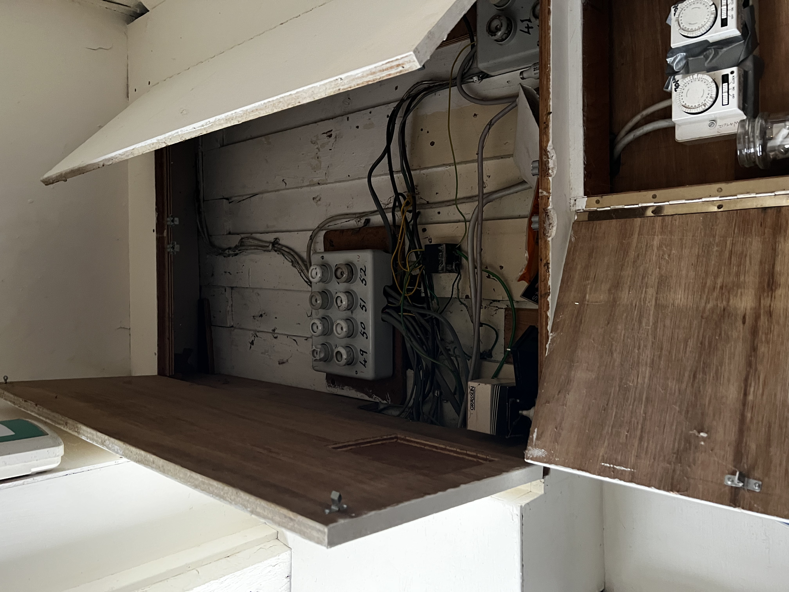](images/14.jpeg)
<Caption>
Image 14: Fuse box found in northern section of the house. Get the impression this is the "back" of the house and didn't get the same attention the southern section did.
</Caption>

<Caption>
Image 15: Plaster from ceiling of "Family Room". I actually really like it - so long as it's just due to age!
</Caption>

<Caption>
Image 16: Fireplace in "Family Room". Original fireplaces are sadly all gone I think.
</Caption>

<Caption>
Image 17: Detail of ceiling in "Family Room".
</Caption>

<Caption>
Image 19: Detail of wiring in "Family Room".
</Caption>

<Caption>
Image 20: Additional detail of wiring in "Family Room".
</Caption>

<Caption>
Image 21: Interior view of windows in "Family Room" - room has a remarkable feel, hard to photograph.
</Caption>

<Caption>
Image 22: View of kitchen.
</Caption>

[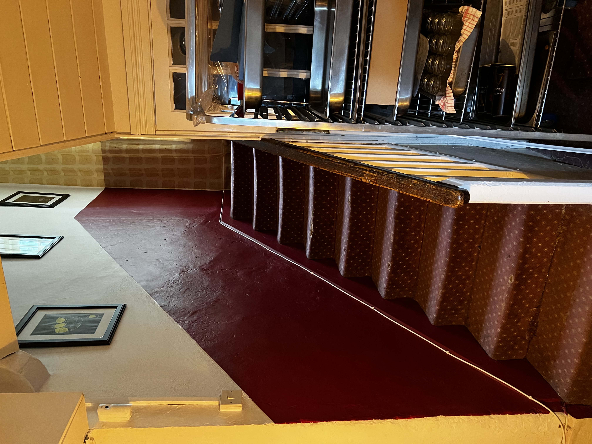](images/23.jpeg)
<Caption>
Image 23: Service stairs.
</Caption>

[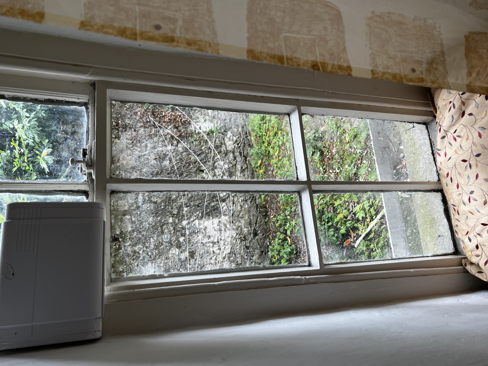](images/24.jpeg)
<Caption>
Image 24: Window on service stairs. Good nick but draughty - checked for damp under that pillow but dry both days.
</Caption>

[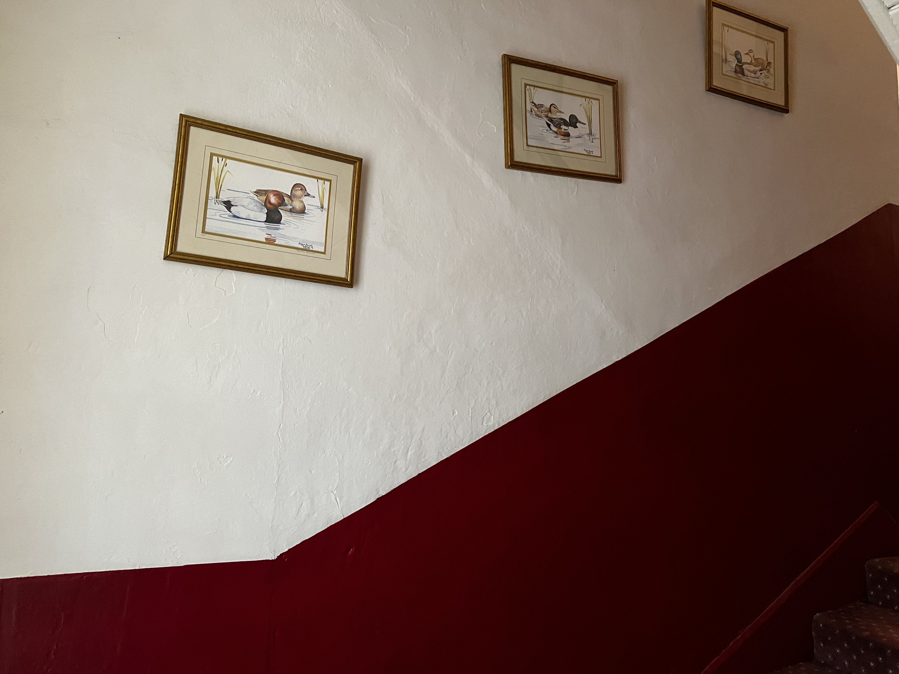](images/25.jpeg)
<Caption>
Image 25: Wall of service stairs - plaster a little splotchy but don't think it's water.
</Caption>

<Caption>
Image 26: Full view of window from image 24.
</Caption>

<Caption>
Image 27: Fuse box in southern section of the house.
</Caption>

<Caption>
Image 28: Underside of main stairs.
</Caption>

[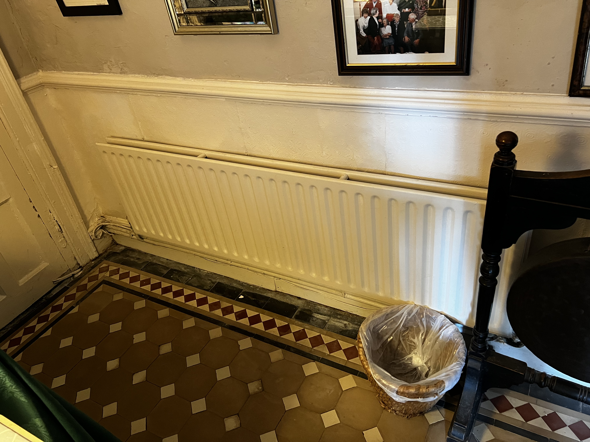](images/29.jpeg)
<Caption> 
Image 29: Radiators, it does have C/H! It's gas fired and eye-wateringly expensive but it exists.
</Caption>

<Caption>
Image 30: Reception room. Moulding is in really good state in this side of the house. My only fear is that the floors over the dining room are sagging when you walk around up there. Sagging to the middle - may be joists reaching end of life. Hopefully if it is, it's possible to replace these without damaging any original plasterwork.
</Caption>

[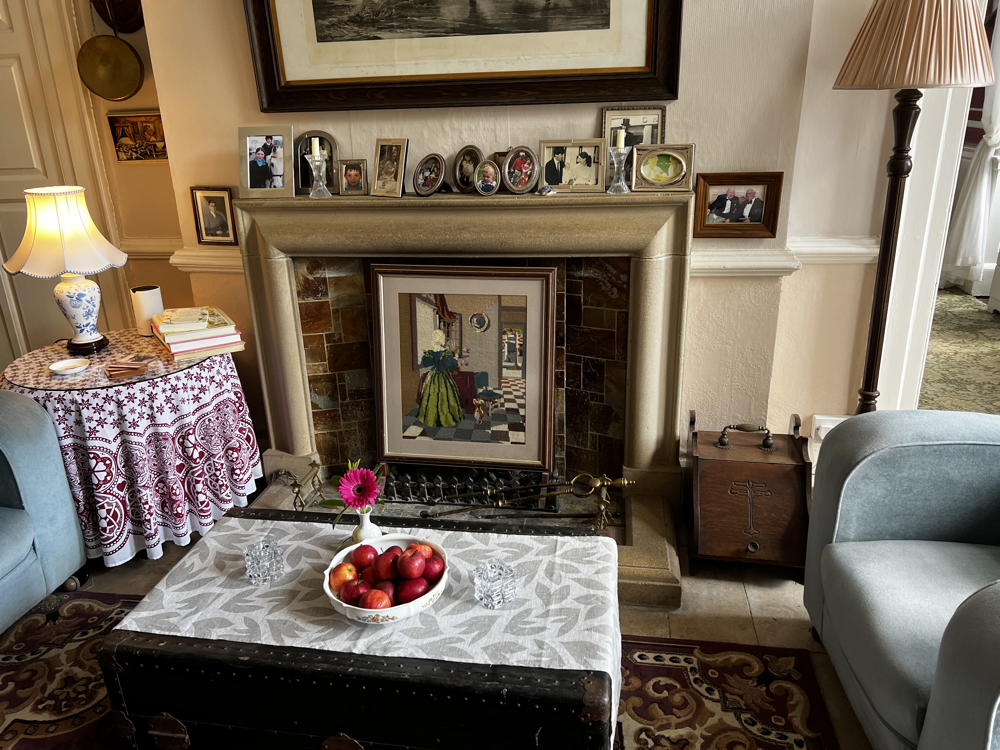](images/31.jpeg)
<Caption>
Image 31: Fireplace in reception.
</Caption>

[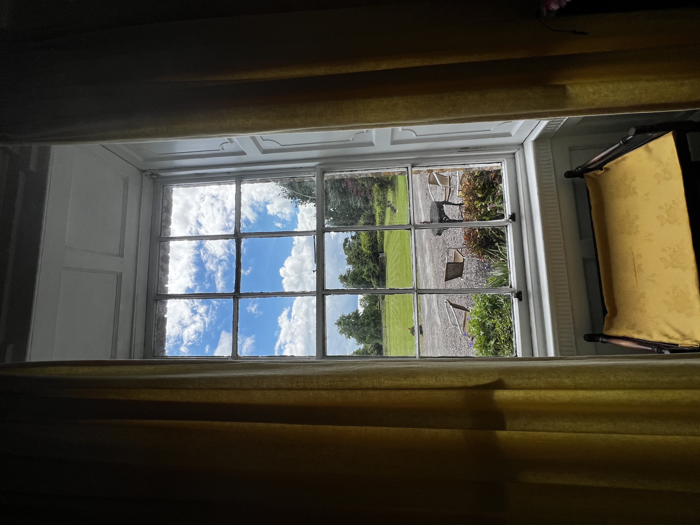](images/32.jpeg)
<Caption>
Image 32: Interior view of drawing room window.
</Caption>

<Caption>
Image 33: Detail interior view of drawing room window.
</Caption>

<Caption>
Image 34: Drawing room.
</Caption>

<Caption>
Image 35: Another view of drawing room.
</Caption>

[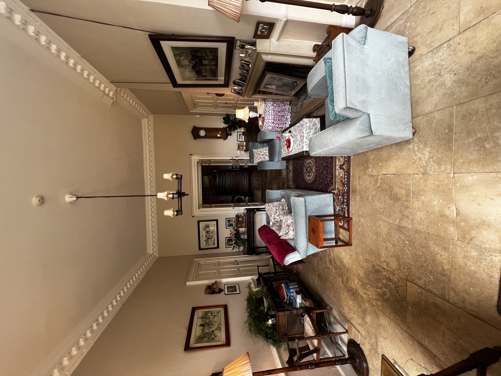](images/36.jpeg)
<Caption>
Image 36: Reception.
</Caption>

<Caption>
Image 37: Dining room.
</Caption>

<Caption>
Image 38: Plaster cracks in dining room.
</Caption>

<Caption>
Image 39: Same image as 38 wider perspective.
</Caption>

<Caption>
Image 40: Some form of bulging over fireplace - or could be a plate? Image 41 is the same on the other side.
</Caption>

<Caption>
Image 41: Other side of fireplace.
</Caption>

<Caption>
Image 42: Fireplace wide view.
</Caption>

[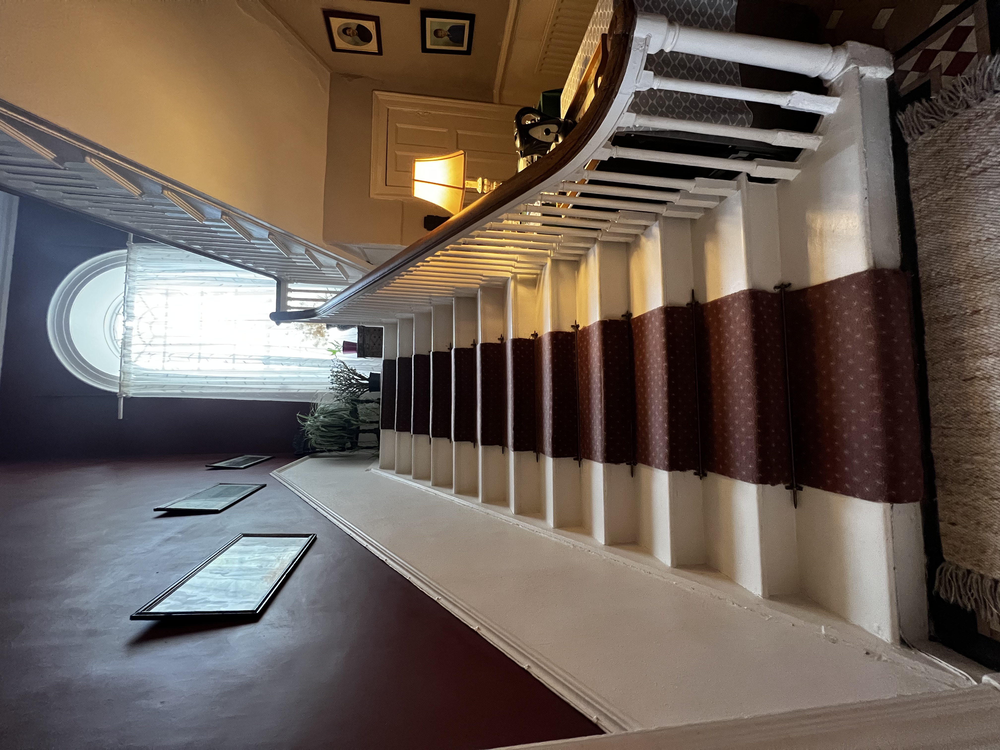](images/43.jpeg)
<Caption>
Image 43: Main staircase.
</Caption>

<Caption>
Image 44: Wall on main staircase, pockmarked.
</Caption>

[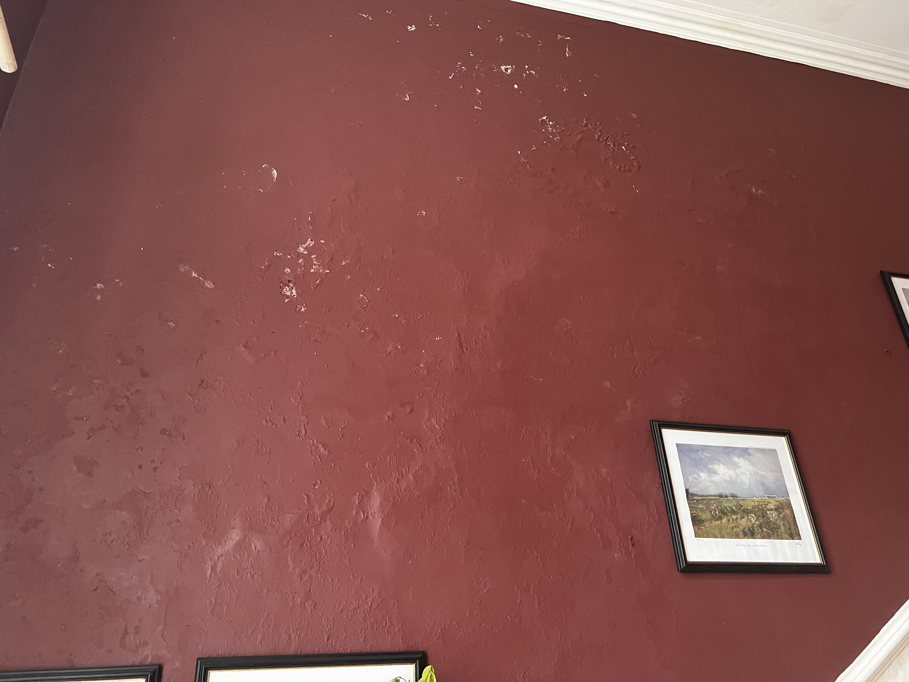](images/45.jpeg)
<Caption>
Image 45: Detail view of wall on main staircase.
</Caption>

<Caption>
Image 46: Ceiling over pockmarked wall on main staircase.
</Caption>

[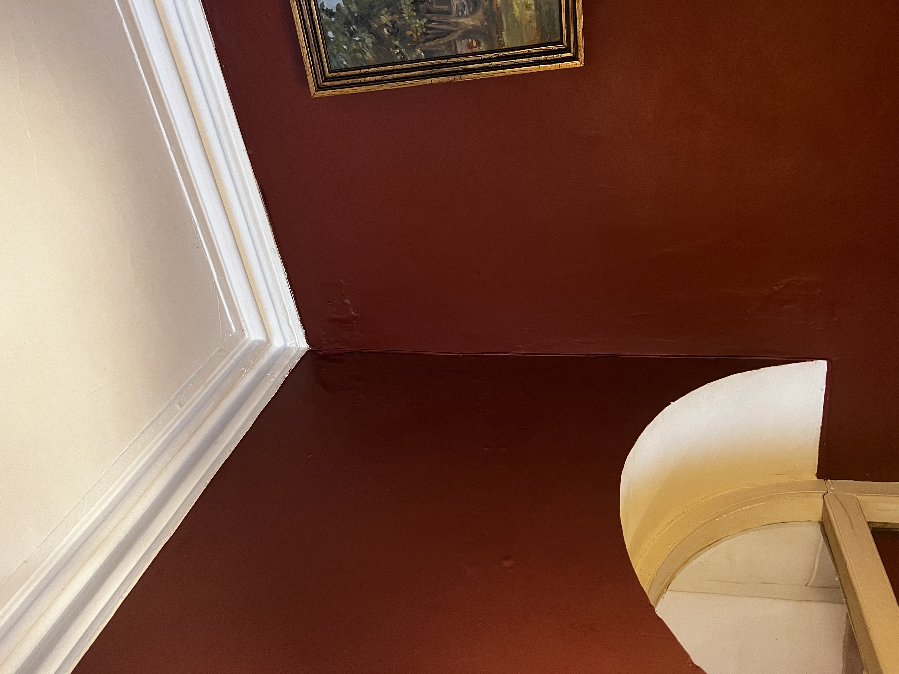](images/47.jpeg)
<Caption>
Image 47: More bulging plaster.
</Caption>

[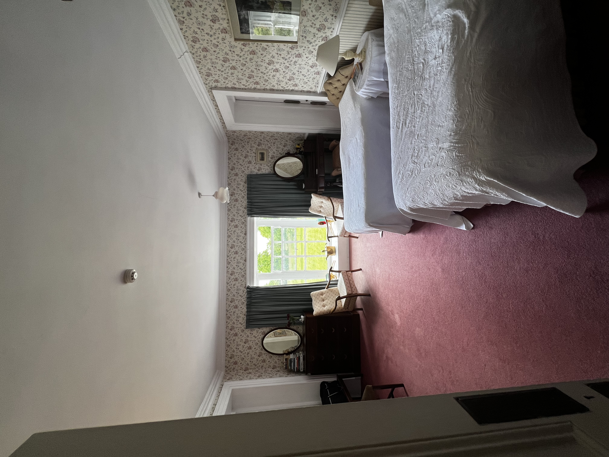](images/48.jpeg)
<Caption>
Image 48: "Bedroom 2" wide view. Floor felt perfect.
</Caption>

<Caption>
Image 49: "Bedroom 2" en suite.
</Caption>

<Caption>
Image 50: "Bedroom 2" ceiling slight discolouration/cracking.
</Caption>

[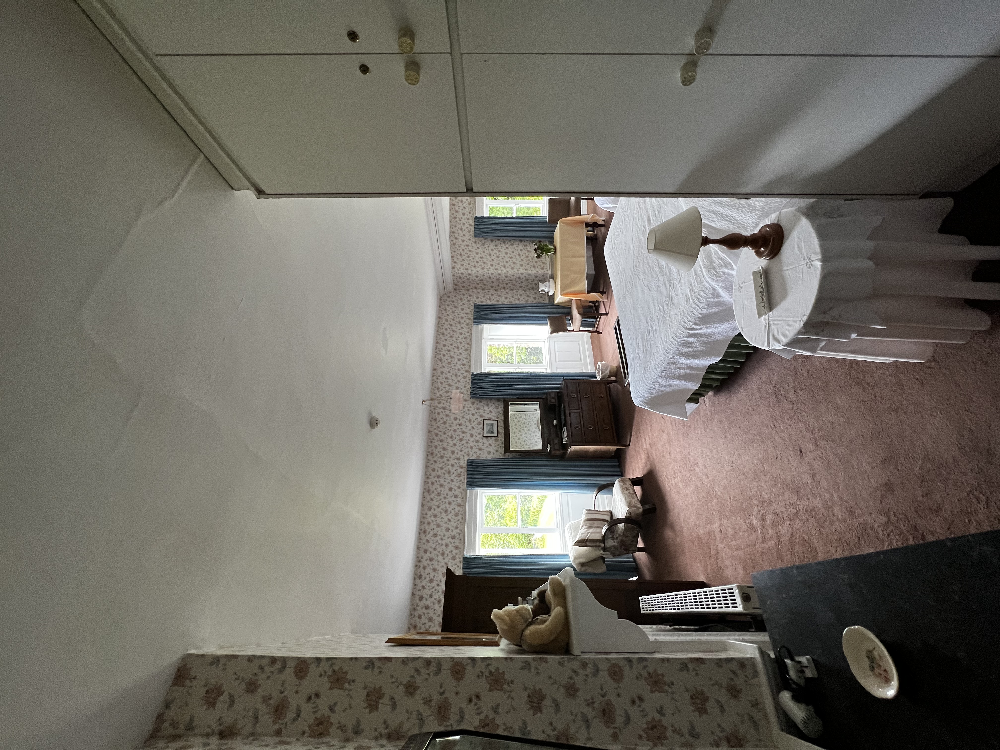](images/52.jpeg)
<Caption>
Image 52: "Bedroom 1" ceiling.
</Caption>

<Caption>
Image 53: "Bedroom 1" ceiling additional perspective.
</Caption>

<Caption>
Image 54:  "Bedroom 1" windows - modern?
</Caption>

<Caption> 
Image 55: Closer view of "Bedroom 1" windows.
</Caption>

<Caption>
Image 56: Strange strut running across ceiling but no signs of water/damp.
</Caption>

<Caption>
Image 59: "Bedroom 1" en suite.
</Caption>

[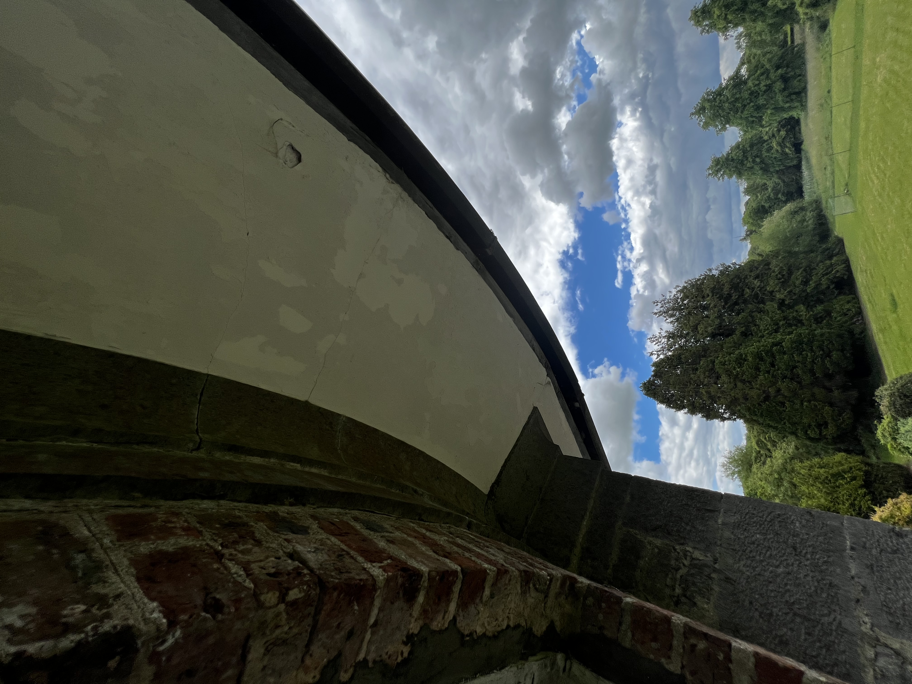](images/60.jpeg)
<Caption>
Image 60: Close up of underside of eaves.
</Caption>

<Caption>
Image 62: Slight pockmarks on plaster.
</Caption>

<Caption>
Image 63: Slight discoloration to ceiling "Bedroom 3".
</Caption>

<Caption>
Image 64: "Bedroom 3"
</Caption>

<Caption>
Image 65: "Bedroom 3" windows - under the window seems repaired.
</Caption>

<Caption>
Image 66: "Bedroom 3" windows - every window in this room is slightly different.
</Caption>

<Caption>
Image 67: "Bedroom 3" floor (slightly) noticeably bowed when walking across.
</Caption>

<Caption>
Image 68: Stairs from landing to "tower house" and service stairs.
</Caption>

<Caption>
Image 69: Corridor on 1st floor of "tower house" - obviously we will know more following a survey of the building - but it would be nice to brighten or widen this corridor somehow if possible.
</Caption>

<Caption>
Image 70: "Bedroom 4" - these rooms noticeably older.
</Caption>

<Caption>
Image 71: "Bedroom 4" ceiling.
</Caption>

<Caption>
Image 72: "Bedroom 4" ensuite ceiling.
</Caption>

<Caption>
Image 73: "Bedroom 4" wall stained - not sure if water.
</Caption>

[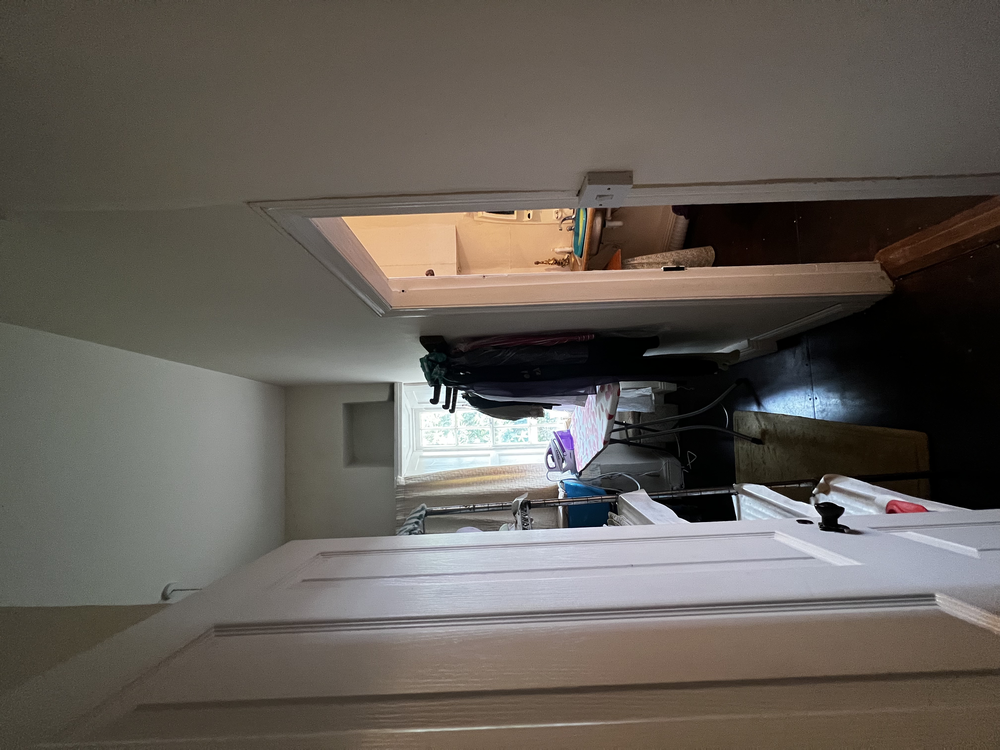](images/74.jpeg)
<Caption>
Image 74: Laundry on first floor of "tower house".
</Caption>

[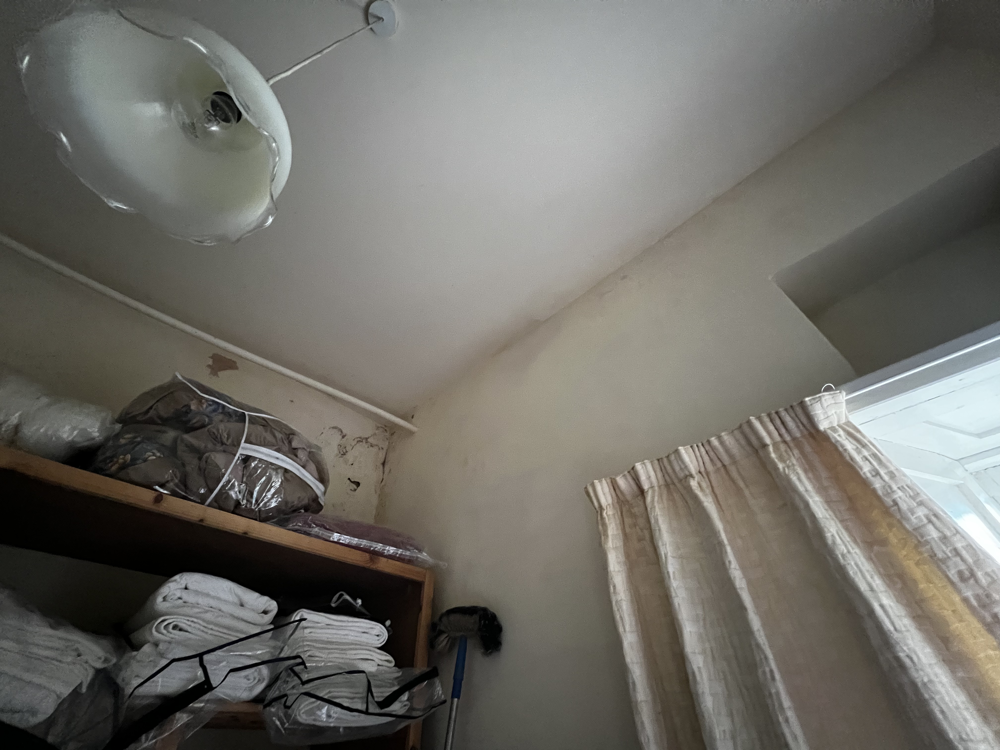](images/75.jpeg)
<Caption>
Image 75: Ceiling of laundry.
</Caption>

<Caption>
Image 76: Stairs leading from "tower house" to northern end of the house. Slanting to left.
</Caption>

<Caption>
Image 77: Ceiling in northern section.
</Caption>

<Caption>
Image 78: "Bedroom 5" in northern section. Panelled ceiling, ensuite, fireplace (not a fireplace itself but style) all of concern.
</Caption>

<Caption>
Image 79: "Bedroom 5" ensuite ceiling.
</Caption>

<Caption>
Image 80: "Bedroom 5" fireplace.
</Caption>

[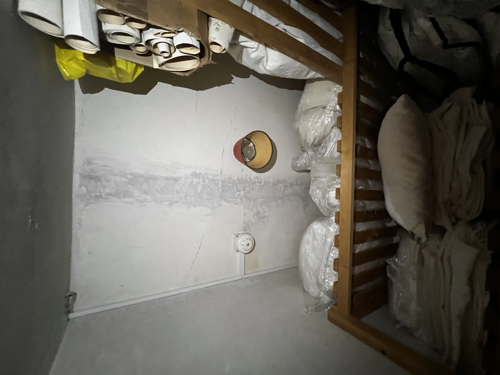](images/81.jpeg)
<Caption>
Image 81: Linen press ceiling. Looks like a pipe repair rather than anything serious.
</Caption>

<Caption>
Image 82: "Bedroom 6" ceiling
</Caption>

<Caption>
Image 84: "Bedroom 6" window
</Caption>

<Caption>
Image 85: "Bedroom 6" ceiling
</Caption>

<Caption>
Image 87: Service stairs to attic.
</Caption>

<Caption>
Image 88: Staining on ceiling in attic.
</Caption>

<Caption>
Image 89: View of brickwork and balcony beyond.
</Caption>

<Caption>
Image 90: View of roof from Balcony.
</Caption>

<Caption>
Image 91: Closeup of roof from Balcony.
</Caption>

[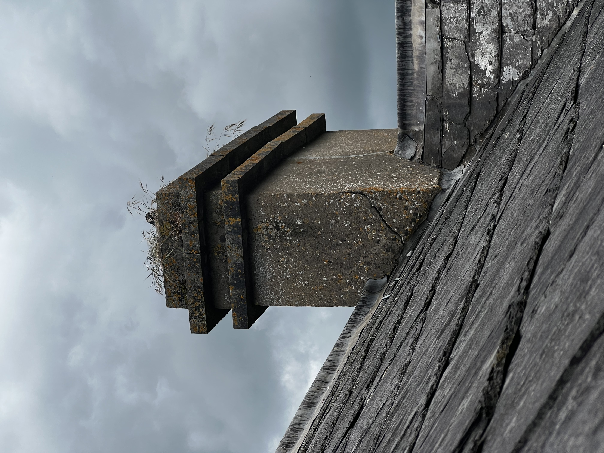](images/92.jpeg)
<Caption>
Image 92: Closeup of chimney from Balcony.
</Caption>

<Caption>
Image 93: "Outbuiling 2"
</Caption>

<Caption>
Image 94: "Outbuiling 2" chimney.
</Caption>

<Caption>
Image 95: Walled garden wall.
</Caption>

<Caption>
Image 96: View of northern face of house from courtyard.
</Caption>

<Caption>
Image 97: Lovely gate on garden.
</Caption>

<Caption>
Image 98: Stables - of all the outbuildings best roof.
</Caption>

<Caption>
Image 99: View of roof from stables - good perspective of the sag in it.
</Caption>

<Caption>
Image 101: Another view of same section of the roof.
</Caption>
